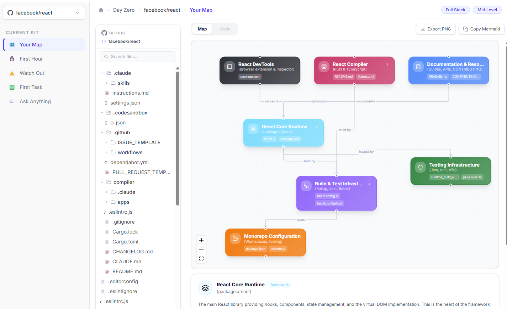

<div align="center">

# Day Zero

**From repo URL to contributing, in minutes.**

Paste a GitHub repository, pick your role and experience level, and get a personalized onboarding kit: an interactive architecture map, a first-hour setup guide, hidden gotchas, a suggested first task, and a chat that knows the codebase.

</div>

<p align="center">
  <a href="https://day-zero-kit.vercel.app/"><strong>Live demo: day-zero-kit.vercel.app</strong></a>
</p>

<p align="center">
  
</p>

---

## Why Day Zero?

Joining an unfamiliar codebase is slow. You read the README, dig through folders, guess which files matter, and ask teammates the same questions everyone asked before you. Day Zero reads the repository for you and turns it into a guide built around **your** role (Frontend, Backend, Full Stack, DevOps) and **your** level (Junior, Mid, Senior).

## Features

| Tab | What you get |
| --- | --- |
| **Your Map** | An interactive architecture graph. Click a node to expand its children top to bottom, drag nodes to rearrange them, and open the files behind any node in a built-in code viewer with a searchable file tree. |
| **First Hour** | A step-by-step setup guide: environment, installation and how to run the project. |
| **Watch Out** | Gotchas and conventions ranked by severity (High, Medium, Low). |
| **First Task** | A safe, meaningful first contribution with the files involved and a difficulty rating. |
| **Ask Anything** | A streaming chat grounded in the repository, with live codebase search. |

Also included:

- One-click **sample repos** (`facebook/react`, `vercel/next.js`, `supabase/supabase`) on the home page and in the kit sidebar.
- A **repo switcher** in the kit sidebar that regenerates the kit only when you pick a different repo.
- An animated **loading experience** that shows each analysis step and overall progress.

## Tech stack

- **Framework:** [Next.js](https://nextjs.org) 16 (App Router, Turbopack), React 19, TypeScript
- **Styling:** Tailwind CSS v4, [shadcn/ui](https://ui.shadcn.com) (Sonner toasts), Lucide icons
- **Diagram:** [React Flow](https://reactflow.dev) (`@xyflow/react`) with [dagre](https://github.com/dagrejs/dagre) auto-layout
- **AI:** Anthropic Claude API (Haiku 4.5) for kit generation and chat
- **Data source:** GitHub REST API for the repository tree and file contents
- **Rendering:** `react-markdown` and `react-syntax-highlighter` for chat answers and the code viewer

## Getting started

### Prerequisites

- Node.js 20 or later
- An [Anthropic API key](https://console.anthropic.com)
- A [GitHub personal access token](https://github.com/settings/tokens) (recommended, to avoid GitHub's low anonymous rate limit)

### Installation

```bash
git clone https://github.com/Viren-45/day-zero.git
cd day-zero
npm install
```

### Environment variables

Create a `.env` file in the project root:

```env
ANTHROPIC_API_KEY=your_anthropic_api_key
GITHUB_TOKEN=your_github_token
```

| Variable | Required | Used for |
| --- | --- | --- |
| `ANTHROPIC_API_KEY` | Yes | Generating the kit and powering Ask Anything |
| `GITHUB_TOKEN` | Recommended | Fetching repository trees and file contents |

`.env*` files are git-ignored, so your keys are never committed.

### Run it

```bash
npm run dev
```

Open [http://localhost:3000](http://localhost:3000).

### Other scripts

| Command | Description |
| --- | --- |
| `npm run build` | Create a production build |
| `npm run start` | Serve the production build |
| `npm run lint` | Run ESLint |

## How it works

```
Home  ──►  /loading-kit  ──►  /kit
form        │                  │
            │ POST /api/generate-kit
            │   1. fetch repo tree + key files (GitHub)
            │   2. build a role/level-aware prompt
            │   3. ask Claude for map, guide, gotchas, task, chat context
            ▼
       kit stored in sessionStorage
                               │
                               ├─ Your Map      ──► /api/file-content (code viewer)
                               └─ Ask Anything  ──► /api/ask-anything (streaming chat)
```

1. The home page collects a repo URL, role and level, then routes to `/loading-kit`.
2. The loading page calls `/api/generate-kit`, showing progress while the kit is generated.
3. The finished kit is cached in `sessionStorage` and `/kit` renders it across the five tabs.
4. Files open on demand through `/api/file-content`; chat answers stream from `/api/ask-anything`.

## Project structure

```
app/
├── page.tsx                  # Home page
├── loading-kit/              # Analysis progress screen
├── kit/                      # Kit results page
├── api/
│   ├── generate-kit/         # Builds the kit with GitHub + Claude
│   ├── ask-anything/         # Streaming chat endpoint
│   └── file-content/         # Fetches file contents for the code viewer
├── components/
│   ├── home/                 # Navbar, hero, onboarding form, sections
│   ├── loading/              # Loading header, steps and progress
│   ├── kit/                  # Sidebar, breadcrumb and the five tabs
│   │   └── tabs/map/         # Diagram, file tree and code viewer
│   └── ui/                   # Shared UI (select, sonner, button)
└── lib/
    ├── claude.ts             # Claude API client
    ├── github.ts             # GitHub API helpers
    ├── prompts.ts            # Prompt builders
    ├── sampleRepos.ts        # Sample repos shared across the app
    └── utils.ts              # cn() and URL parsing helpers
```

## Notes and limitations

- Only **public** repositories are supported unless your `GITHUB_TOKEN` has access to a private one.
- Very large repositories are analyzed from the repository tree and key files rather than every file, so the kit is a strong starting point, not an exhaustive audit.
- Generated content comes from an LLM and can contain mistakes. Treat the kit as a guide and confirm details in the code.

## Built for the IBM Bob hackathon

Development sessions with Bob are documented in [`bob_sessions/`](./bob_sessions).
